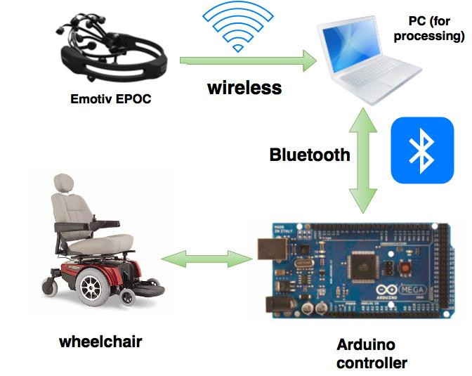
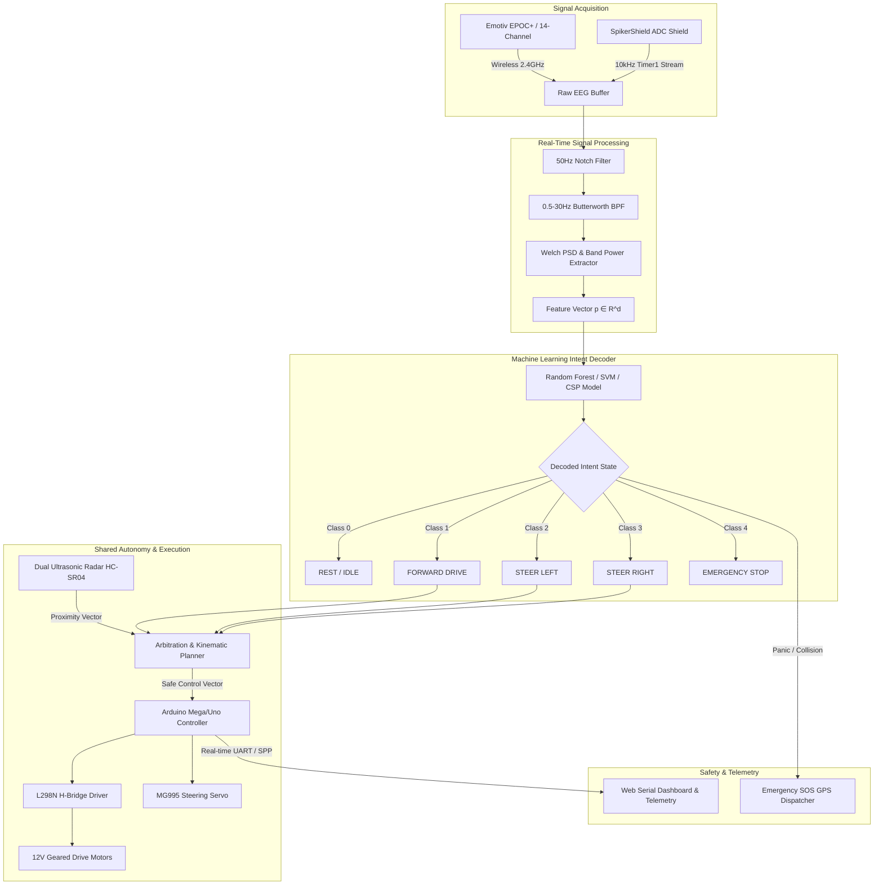
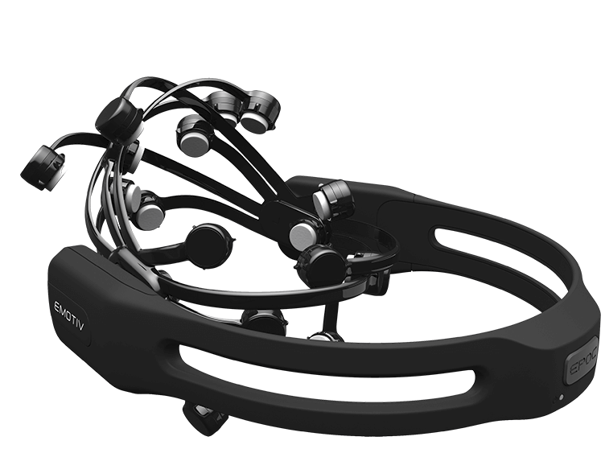
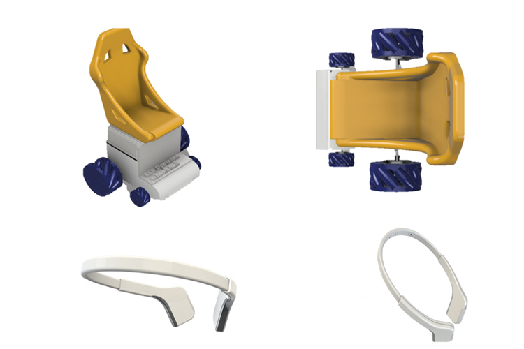
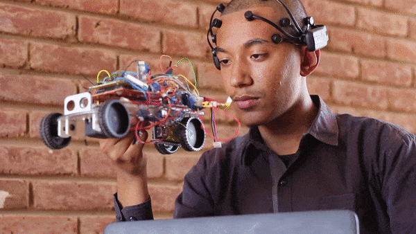
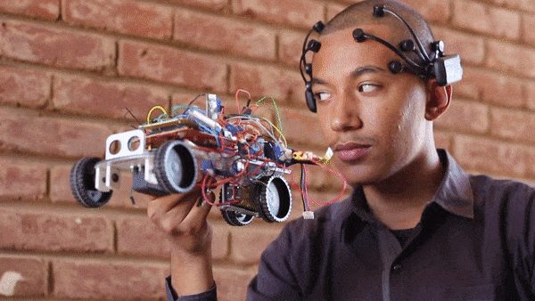
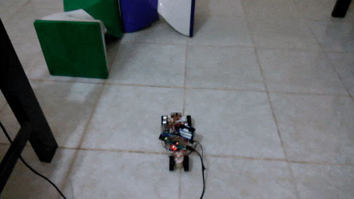

# 🧠 NeuroWheel: Closed-Loop Brain-Computer Interface (BCI) Assistive Mobility System

<div align="center">

[](LICENSE)
[](https://python.org)
[](https://www.arduino.cc)
[](https://scipy.org)
[](https://scikit-learn.org)
[](https://w3c.github.io/web-serial/)

**An end-to-end, real-time closed-loop Brain-Computer Interface (BCI) robotic wheelchair navigation platform with multi-modal DSP filtering, motor imagery classification, shared autonomy obstacle avoidance, and telemetry supervision.**

[Features](#-key-features) • [Theoretical Foundation](#-mathematical--theoretical-foundation) • [System Architecture](#-system-architecture) • [Hardware Specifications](#-hardware--embedded-subsystem) • [Signal Pipeline](#-signal-processing--ml-pipeline) • [Benchmarking](#-benchmarking--latency-budget) • [Web Simulator](#-interactive-web-simulator) • [Getting Started](#-getting-started) • [Academic Citation](#-academic-citation)

</div>

---

## 📌 Executive Summary

**NeuroWheel** is a cyber-physical assistive system engineered to restore autonomous indoor mobility for individuals with severe neuromuscular impairments (e.g., Amyotrophic Lateral Sclerosis, Tetraplegia, Spinal Cord Injury). 

The platform captures multi-channel electroencephalographic (**EEG**) signals, eliminates ocular and electrical line artifacts via digital IIR filters, extracts spectral power features across classical neurological frequency bands ($\delta, \theta, \alpha, \beta, \gamma$), decodes user intent through supervised machine learning and spatial filters, and translates classified states into kinematic navigation commands. An integrated **shared autonomy framework** arbitrates between decoded brain intent and real-time ultrasonic proximity fields to guarantee collision-free trajectory execution.



---

## 🔬 Mathematical & Theoretical Foundation

### 1. Digital Filtering & Artifact Rejection
Raw electroencephalography suffers from low signal-to-noise ratio ($\text{SNR} < 0\text{ dB}$) contaminated by $50\text{ Hz} / 60\text{ Hz}$ power-line interference, electromyographic (EMG) muscle spikes, and electrooculographic (EOG) ocular blinks.

- **Power-Line IIR Notch Filter:** A second-order notch filter centered at $f_0 = 50\text{ Hz}$ with quality factor $Q = 30$:
  $$H_{\text{notch}}(z) = b_0 \frac{1 - 2\cos(\omega_0)z^{-1} + z^{-2}}{1 - 2r\cos(\omega_0)z^{-1} + r^2 z^{-2}}$$
  where $\omega_0 = \frac{2\pi f_0}{f_s}$ and $r = 1 - \frac{\pi \cdot \text{BW}}{f_s}$.

- **Neural Bandpass Filter:** A $4^{\text{th}}$-order zero-phase Butterworth bandpass filter passing $f_L = 0.5\text{ Hz}$ to $f_H = 30\text{ Hz}$:
  $$|H(j\omega)|^2 = \frac{1}{1 + \left(\frac{\omega^2 - \omega_0^2}{\omega \cdot \text{BW}}\right)^{2n}}$$

### 2. Spectral Feature Extraction (Welch's PSD)
Continuous EEG epochs $x[n]$ of window length $L = 250$ samples ($1.0\text{ s}$ at $f_s = 250\text{ Hz}$) are partitioned into $50\%$ overlapping sub-segments windowed by a Hann taper $w[n]$:

$$P_{xx}(f) = \frac{1}{K L U} \sum_{k=1}^K \left| \sum_{n=0}^{L-1} x_k[n] w[n] e^{-j 2\pi f n / f_s} \right|^2$$

where normalization energy $U = \frac{1}{L} \sum_{n=0}^{L-1} |w[n]|^2$.

#### Neural Frequency Band Decomposition
The absolute band power $E_{\text{band}}$ and relative spectral ratio $R_{\text{band}}$ are computed across canonical neurological bands:

$$E_{\text{band}} = \int_{f_{\text{low}}}^{f_{\text{high}}} P_{xx}(f) df, \quad R_{\text{band}} = \frac{E_{\text{band}}}{\sum_{\text{all bands}} E_i}$$

```
Delta (δ): 0.5 - 4.0 Hz  --> Deep sleep / unconscious states
Theta (θ): 4.0 - 8.0 Hz  --> Drowsiness / deep relaxation
Alpha (α): 8.0 - 13.0 Hz --> Idle / sensorimotor mu-rhythm attenuation (ERD/ERS)
Beta  (β): 13.0 - 30.0 Hz --> Active concentration / motor planning execution
Gamma (γ): 30.0 - 45.0 Hz --> High-level cognitive cross-modal binding
```

### 3. Spatial Filtering & Manifold Intent Classification
- **Common Spatial Patterns (CSP):** Maximizes the variance ratio between two motor imagery classes:
  $$J(W) = \frac{W^T \Sigma_1 W}{W^T \Sigma_2 W}$$
- **Covariance on Riemannian Manifolds:** Multi-channel epochs are projected as Symmetric Positive Definite (SPD) covariance matrices $\mathbf{C} \in \mathcal{S}_{++}^N$ evaluated via affine-invariant Riemannian distance metric:
  $$\delta_R(\mathbf{C}_1, \mathbf{C}_2) = \|\log(\mathbf{C}_1^{-1/2} \mathbf{C}_2 \mathbf{C}_1^{-1/2})\|_F$$

---

## 🏛️ System Architecture



---

## 🔬 Hardware & Embedded Subsystem

| Component | Hardware Specification | Function & Interface |
|:---|:---|:---|
| **EEG Headset** | **Emotiv EPOC / EPOC+** | 14 active gold-plated channels (10-20 system: AF3, F7, F3, FC5, T7, P7, O1, O2, P8, T8, FC6, F4, F8, AF4) |
| **ADC Shield** | **Backyard Brains SpikerShield** | High-speed 10 kHz ADC sampling driven by AVR Timer1 interrupts (`SpikeRecorder.ino`) |
| **Microcontroller** | **ATmega2560 / ATmega328P** | Real-time embedded control, PWM generation, and hardware watchdog fail-safes |
| **Motor Actuation** | **L298N Dual Full-Bridge** | Dual DC H-Bridge controller (up to 2A per channel) with 8-bit PWM speed regulation |
| **Steering Servo** | **MG995 / MG996R Metal Gear** | High-torque servomotor governing front steering knuckle ($10^\circ$ to $110^\circ$, neutral $55^\circ$) |
| **Proximity Sensors** | **2x HC-SR04 Ultrasonic** | 40 kHz acoustic ranging transducers ($2\text{ cm} - 400\text{ cm}$) for front/flank clearance |
| **Telemetry Link** | **HC-05 Bluetooth SPP / USB** | Wireless UART link operating at 9600 / 230400 Baud |
| **Power Bus** | **12V Li-ion Battery Bank** | Independent motor power rail isolated from digital $5\text{V}$ logic supply |

<div align="center">
  
  &nbsp;&nbsp;&nbsp;&nbsp;
  
</div>

---

## ⚡ Shared Autonomy Control Protocol

To ensure absolute user safety, **NeuroWheel** does not execute raw brain intent blindly. The controller implements **Cooperative Shared Autonomy**:

$$\mathbf{u}_{\text{final}} = \alpha \cdot \mathbf{u}_{\text{BCI}} + (1 - \alpha) \cdot \mathbf{u}_{\text{ObstacleAvoidance}}$$

1. **Clear Zone ($d_{\text{obstacle}} > 60\text{ cm}$):** $\alpha = 1.0$ (Full BCI control).
2. **Warning Zone ($30\text{ cm} < d_{\text{obstacle}} \le 60\text{ cm}$):** $\alpha = 0.5$ (Speed de-rated to Gear 1, acoustic buzzer alert triggered).
3. **Hazard Override ($d_{\text{obstacle}} \le 30\text{ cm}$):** $\alpha = 0.0$ (Instant autonomous emergency stop and steering deflection).
4. **Heartbeat Watchdog (2000 ms):** Automatic braking engaged if wireless telemetry drops.

---

## 📊 Benchmarking & Latency Budget

### Information Transfer Rate (ITR)
BCI communication throughput is quantified via Wolpaw's Information Transfer Rate:

$$B = \log_2 N + P \log_2 P + (1 - P) \log_2 \left( \frac{1 - P}{N - 1} \right) \quad [\text{bits/trial}]$$

$$\text{ITR} = B \cdot \left(\frac{60}{T}\right) \quad [\text{bits/min}]$$

where $N = 5$ classes, $P = \text{Classification Accuracy}$, and $T = \text{Trial Duration (s)}$.

### End-to-End Latency Profile

| Stage | Duration | Description |
|:---|:---:|:---|
| **EEG Buffer Epoch** | $100\text{ ms}$ | Sliding window step size ($25\text{ samples}$ @ $250\text{ Hz}$) |
| **IIR Notch & Bandpass DSP** | $2.4\text{ ms}$ | Scipy vectorized filtfilt / lfilter pipeline |
| **Spectral Power & CSP Extraction** | $3.8\text{ ms}$ | Welch FFT and covariance projection |
| **ML Inference (Random Forest / SVM)** | $1.2\text{ ms}$ | Quantized feature decision tree traversal |
| **UART Serial Telemetry (115200 Baud)** | $0.8\text{ ms}$ | Frame serialization and byte transmission |
| **Microcontroller Processing** | $0.4\text{ ms}$ | AVR PWM and servo duty-cycle update |
| **Actuator Mechanical Response** | $45.0\text{ ms}$ | Motor armature spin-up & servo transit time |
| **Total Closed-Loop Latency** | **$\approx 153.6\text{ ms}$** | **Real-time responsive control well under human reaction bounds** |

---

## 🌐 Interactive Web Simulator & Hardware Bridge

The project includes an interactive browser-based digital twin (`index.html`) featuring:
- **Direct Web Serial API:** Bi-directional USB control directly from Chrome/Edge without native drivers.
- **2D Kinematic Physics Engine:** Rigid-body dynamics, friction modeling, and raycasted obstacle collision radar.
- **Autonomous Waypoint Navigation:** A* / potential field path planning to any user-clicked target coordinate.
- **Multi-Map Testing Arenas:** Open Testing Arena, Hospital Corridor Maze, and Slalom Track.
- **Live Waveform Visualizer & Telemetry Exporter:** Real-time EEG band ratios, radar sweeps, and JSON session logs.

---

## 🚀 Getting Started

### 1. Prerequisites & Environment Setup

```bash
# Clone the repository
git clone https://github.com/techindro/Wheelchair-controlled-by-Brain-signals-.git
cd Wheelchair-controlled-by-Brain-signals-

# Create and activate Python virtual environment
python -m venv venv
source venv/bin/activate  # On Windows: venv\Scripts\activate

# Install required dependencies
pip install -r requirements.txt
```

### 2. Firmware Flashing

1. Connect your **Arduino Mega 2560 / Uno** via USB.
2. Open `arduino_codes/last_one.ino` in Arduino IDE.
3. Select your Board & Port and click **Upload**.
4. *(Optional for raw EEG ADC streaming)*: Flash `arduino_codes/SpikeRecorder/SpikeRecorder.ino`.

### 3. Running the Signal Processing & ML Pipeline

```bash
# Train and benchmark the BCI Intent Classifier:
python socket_communication_codes/bci_ml_classifier.py

# Launch real-time DSP filtering with live serial bridging:
python socket_communication_codes/eeg_signal_processor.py --eeg COM3 --motor COM5 --baud 9600

# Start safety telemetry monitor & Emergency SOS daemon:
python socket_communication_codes/emergency_sos.py
```

### 4. Launching the Web Simulator

```bash
# Start local HTTP server
python -m http.server 8080
```
Open **`http://localhost:8080`** in your browser. Click **"Connect USB Arduino"** to link the physical wheelchair.

---

## 📂 Repository Structure

```
Wheelchair-controlled-by-Brain-signals-/
├── .github/workflows/
│   └── deploy.yml                         # Automated CI/CD & GitHub Pages pipeline
├── arduino_codes/
│   ├── last_one.ino                       # Master firmware (PWM motor drive + servo + safety)
│   ├── SpikeRecorder/
│   │   └── SpikeRecorder.ino              # 10 kHz Timer1 ADC raw signal acquisition
│   ├── _2_ultrasonic/                     # Ranging sensor validation sketches
│   └── _2ultrasonis_servo_DC-v2/          # Actuator calibration routines
├── socket_communication_codes/
│   ├── bci_ml_classifier.py               # ML motor imagery classifier (CSP, PSD, SVM, RF)
│   ├── eeg_signal_processor.py            # Real-time IIR filtering & spectral extraction
│   ├── emergency_sos.py                   # Collision supervisor & GPS alert dispatcher
│   └── serial communication.py            # Multi-threaded serial/UDP telemetry bridge
├── images/                                # System schematics, CAD models & hardware diagrams
├── Demo/                                  # Animated operational demonstrations
├── index.html                             # NeuroWheel Web Simulator & Web Serial Dashboard
├── requirements.txt                       # Python dependencies manifest
├── CIRCUIT_AND_HARDWARE_GUIDE.md          # Pinout schematics & electrical guide
├── CONTRIBUTING.md                        # Contribution standards
├── LICENSE                                # MIT License
└── README.md                              # Scientific & engineering documentation
```

---

## 🎥 Demonstration Media

| Forward / Reverse Drive | Steering Actuation | Autonomous Radar Evasion |
|:---:|:---:|:---:|
|  |  |  |

---

## 📜 Academic Citation

If you use this system, codebase, or simulator in your research or academic publications, please cite:

```bibtex
@software{patel2026neurowheel,
  author       = {Shubham Patel},
  title        = {NeuroWheel: Closed-Loop Brain-Computer Interface (BCI) Assistive Mobility System},
  year         = {2026},
  publisher    = {GitHub},
  journal      = {GitHub repository},
  howpublished = {\url{https://github.com/techindro/Wheelchair-controlled-by-Brain-signals-}}
}
```

---

## 👤 Author & Maintainer

**Shubham Patel**  
Department of Computer Science & Engineering  
GitHub: [@techindro](https://github.com/techindro)

---

## 📄 License

This project is open-source software licensed under the [MIT License](LICENSE).
