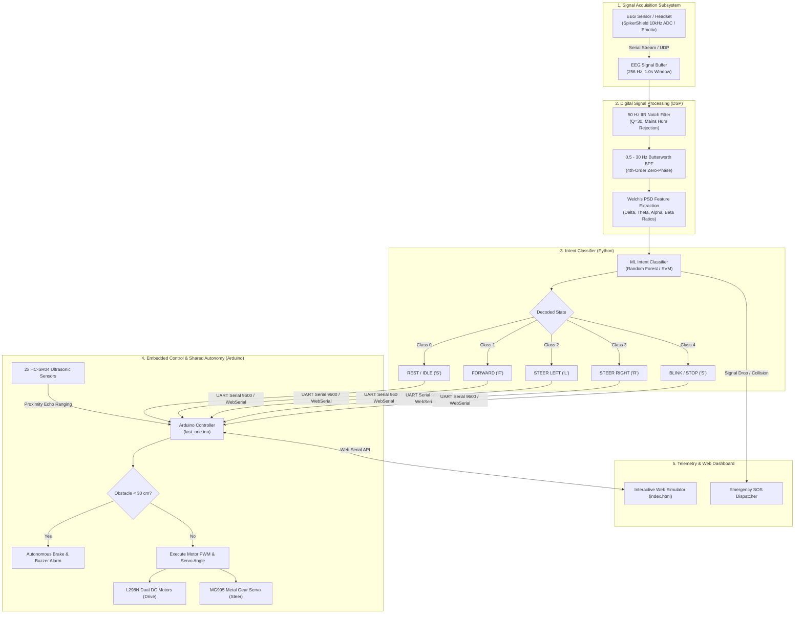

# 🧠 NeuroWheel: Closed-Loop Brain-Computer Interface (BCI) Assistive Mobility System

<div align="center">

[](LICENSE)
[](https://python.org)
[](https://www.arduino.cc)
[](https://scipy.org)
[](https://scikit-learn.org)
[](https://w3c.github.io/web-serial/)

**An end-to-end, real-time closed-loop Brain-Computer Interface (BCI) robotic wheelchair navigation platform with multi-modal DSP filtering, motor imagery classification, shared autonomy obstacle avoidance, and telemetry supervision.**

[Architecture](#-system-architecture) • [Signal Pipeline](#-signal-processing--ml-pipeline) • [Hardware Specifications](#-hardware--embedded-subsystem) • [Command Protocols](#-command-mapping--control-logic) • [Web Simulator](#-interactive-web-simulator) • [Getting Started](#-getting-started) • [Academic Citation](#-academic-citation)

</div>

---

## 📌 Project Overview

**NeuroWheel** is an end-to-end assistive mobility system designed to translate electroencephalographic (EEG) brain signals into navigation commands for a motorized robotic wheelchair. 

The system implements a full closed-loop architecture:
1. **Signal Acquisition:** Streams raw neural potential data via serial interfaces (Backyard Brains SpikerShield ADC / Emotiv EPOC).
2. **Digital Signal Processing (DSP):** Real-time $50\text{ Hz}$ IIR notch filtering for mains hum removal and $0.5 - 30\text{ Hz}$ $4^{\text{th}}$-order zero-phase Butterworth bandpass filtering.
3. **Feature Extraction:** Welch's Power Spectral Density (PSD) computation to derive absolute and relative band powers for **Delta ($\delta$)**, **Theta ($\theta$)**, **Alpha ($\alpha$)**, and **Beta ($\beta$)** bands alongside statistical moments.
4. **Machine Learning Intent Decoding:** Supervised classification (Random Forest & Support Vector Machines) mapping mental state features to discrete motion intents (`REST`, `FORWARD`, `LEFT`, `RIGHT`, `BLINK_STOP`).
5. **Microcontroller Actuation & Safety:** Arduino Mega/Uno firmware executing dual DC motor drive (L298N), active servo steering (MG995), ultrasonic collision avoidance (HC-SR04), and emergency watchdog fail-safes.
6. **Web Dashboard & Hardware-in-the-Loop Twin:** Browser-based simulator with direct **Web Serial API** support to control the physical hardware directly from the browser.


---

## 🏛️ System Architecture



---

## 🔬 Signal Processing & ML Pipeline

### 1. Digital IIR Filtering (DSP)
The signal processing pipeline (`eeg_signal_processor.py`) cleans raw incoming neural voltage sequences using:

* **50 Hz Mains Notch Filter:** Removes AC power-line electromagnetic interference:
  $$\text{Filter: } \text{IIR Notch at } f_0 = 50\text{ Hz}, \quad Q = 30.0$$
* **0.5 – 30 Hz Bandpass Filter:** $4^{\text{th}}$-order zero-phase Butterworth filter isolating physiological brain rhythms while rejecting high-frequency EMG muscle noise and DC drift:
  $$\text{Passband: } [0.5\text{ Hz}, 30.0\text{ Hz}], \quad N = 4\text{ (Butterworth)}$$

### 2. Spectral Feature Extraction
Features are extracted over sliding epochs ($N = 256$ samples at $f_s = 256\text{ Hz}$, $50\%$ overlap) using Welch's method ($P_{xx}(f)$):

$$\text{Band Power } E_{\text{band}} = \int_{f_{\text{low}}}^{f_{\text{high}}} P_{xx}(f) df, \quad \text{Relative Power } R_{\text{band}} = \frac{E_{\text{band}}}{\sum E_{\text{all}}}$$

| Band | Frequency Range | Physiological Correlate | Role in Control Logic |
|:---|:---|:---|:---|
| **Delta ($\delta$)** | $0.5 - 4.0\text{ Hz}$ | Deep rest / low arousal | Baseline energy normalization |
| **Theta ($\theta$)** | $4.0 - 7.0\text{ Hz}$ | Drowsiness / deep relaxation | High theta triggers drowsiness auto-stop |
| **Alpha ($\alpha$)** | $8.0 - 13.0\text{ Hz}$ | Relaxed wakefulness / closed eyes | Alpha dominance ($>60\%$) triggers `STOP` |
| **Beta ($\beta$)** | $14.0 - 30.0\text{ Hz}$ | Active focus / motor engagement | High $\beta/\alpha$ ratio ($>1.5$) triggers `FORWARD` |

Time-domain statistical features (Mean, Standard Deviation, Variance, RMS, Kurtosis, Skewness) are concatenated to form the complete feature vector $\mathbf{x} \in \mathbb{R}^{14}$.

### 3. Machine Learning Classification
`bci_ml_classifier.py` trains and benchmarks a **Random Forest Classifier** ($100$ estimators, maximum depth $10$) and **Support Vector Machine (SVM)** with standard feature scaling across 5 discrete intention states:

```
Class 0: REST         --> Relaxed state (Alpha dominance, standard speed gear)
Class 1: FORWARD      --> Motor intention / focus (Mu rhythm suppression, elevated Beta)
Class 2: LEFT         --> Left steer imagery (Asymmetric hemispheric activation)
Class 3: RIGHT        --> Right steer imagery (Elevated contralateral rhythm)
Class 4: BLINK_STOP   --> High-amplitude ocular artifact spike (Emergency halt)
```

---

## 🔬 Hardware & Embedded Subsystem

| Subsystem | Real Physical Device / Model | Technical Function & Interface |
|:---|:---|:---|
| **EEG Acquisition** | **Backyard Brains SpikerShield / Emotiv** | High-speed ADC signal acquisition / wireless electrode telemetry |
| **Microcontroller** | **Arduino Mega 2560 / Arduino Uno** | ATmega AVR microcontroller executing motor PWM, servo PWM, and sensor polling |
| **Motor Driver** | **L298N Dual H-Bridge Module** | Controls two 12V DC geared motors with 8-bit PWM speed control (Pins 5, 6, 9, 10) |
| **Steering Actuator** | **MG995 / MG996R Metal Gear Servo** | Direct front steering knuckle control ($10^\circ$ to $110^\circ$, Pin 3) |
| **Ranging Sensors** | **2x HC-SR04 Ultrasonic Sensors** | Dual ultrasonic echo ranging transducers measuring front distance (Pins 2, 4, 11, 12) |
| **Warning Alarm** | **5V Active Buzzer** | Audio collision alert buzzer (Digital Pin 8) |
| **Wireless Telemetry** | **HC-05 Bluetooth Module / USB UART** | Serial UART link operating at 9600 Baud for remote telemetry |
| **Power Supply** | **12V Li-ion Battery Bank** | Independent motor power supply isolated from 5V Arduino digital rail |

<div align="center">
  
  &nbsp;&nbsp;&nbsp;&nbsp;
  
</div>

---

## 🕹️ Command Mapping & Control Logic

| Serial Command | Navigation Action | Steering Servo Angle | Motor State & Description |
|:---:|:---|:---:|:---|
| `'f'` | Forward Drive | $55^\circ$ (Center) | Dual DC motors drive forward at active PWM gear |
| `'b'` | Reverse Drive | $55^\circ$ (Center) | Dual DC motors drive in reverse at active PWM gear |
| `'l'` | Steer Left | $110^\circ$ (Full Left) | Steers front wheels left while driving forward |
| `'r'` | Steer Right | $10^\circ$ (Full Right) | Steers front wheels right while driving forward |
| `'s'` | Full Stop / Brake | $55^\circ$ (Center) | Halts motor outputs immediately ($PWM = 0$) |
| `'1'` | Speed Gear 1 | — | Low speed / indoor safe mode ($PWM = 120$) |
| `'2'` | Speed Gear 2 | — | Standard operational speed ($PWM = 180$) |
| `'3'` | Speed Gear 3 | — | Full speed outdoor mode ($PWM = 255$) |

### Fail-Safe & Safety Architecture
- **Automatic Ultrasonic Collision Avoidance:** If either HC-SR04 sensor detects an obstacle within $30\text{ cm}$, the Arduino immediately overrides drive commands, stops both motors, and sounds the active buzzer.
- **Heartbeat Watchdog (2000 ms):** The firmware includes a safety timeout that halts motors if communication packets cease while in motion.
- **Emergency SOS Dispatcher (`emergency_sos.py`):** Background telemetry watcher that triggers simulated GPS alert packets upon continuous signal loss or collision flags.

---

## 🌐 Interactive Web Simulator & Hardware Bridge

The repository includes a comprehensive client-side simulator and control dashboard in **`index.html`**:

* **Web Serial API Bridge:** Directly connect and control your physical Arduino over USB from Google Chrome or Microsoft Edge with zero native driver installation.
* **2D Kinematic Physics Simulation:** Real-time steering kinematics, inertia, surface friction, and raycast obstacle radar.
* **Autonomous Waypoint Navigation:** Click anywhere on the map to deploy a navigation target; the wheelchair calculates heading and routes around obstacles.
* **Multi-Environment Maps:** Open Testing Ground, Hospital Corridors, and Slalom Track.
* **Telemetry Logger:** Real-time visualization of EEG spectral powers, ultrasonic distances, and JSON telemetry export.

---

## 🚀 Getting Started

### 1. Installation & Environment Setup

```bash
# Clone the repository
git clone https://github.com/techindro/Wheelchair-controlled-by-Brain-signals-.git
cd Wheelchair-controlled-by-Brain-signals-

# Create and activate Python virtual environment
python -m venv venv
# On Linux/macOS:
source venv/bin/activate
# On Windows:
venv\Scripts\activate

# Install dependencies
pip install -r requirements.txt
```

### 2. Uploading Arduino Firmware

1. Open [arduino_codes/last_one.ino](arduino_codes/last_one.ino) in the Arduino IDE.
2. Select your board (**Arduino Mega 2560** or **Arduino Uno**) and COM Port.
3. Refer to [CIRCUIT_AND_HARDWARE_GUIDE.md](CIRCUIT_AND_HARDWARE_GUIDE.md) for pinout verification.
4. Click **Upload**.

### 3. Running Signal Processing & Machine Learning

```bash
# Run the ML classifier training & validation:
python socket_communication_codes/bci_ml_classifier.py

# Run real-time DSP signal processor (auto-detects ports or specify manually):
python socket_communication_codes/eeg_signal_processor.py --eeg COM3 --motor COM5

# Or run in simulation mode without physical hardware:
python socket_communication_codes/eeg_signal_processor.py --simulate

# Run safety telemetry & Emergency SOS dispatcher:
python socket_communication_codes/emergency_sos.py
```

### 4. Running the Web Simulator

```bash
# Start a local web server
python -m http.server 8080
```
Open **`http://localhost:8080`** in your browser. Click **"Connect USB Arduino"** to link the physical wheelchair over Web Serial API.

---

## 📂 Repository Structure

```
Wheelchair-controlled-by-Brain-signals-/
├── .github/workflows/
│   └── deploy.yml                         # Automated CI/CD & GitHub Pages pipeline
├── arduino_codes/
│   ├── last_one.ino                       # Master Arduino firmware (PWM motors + servo + ultrasonic)
│   ├── SpikeRecorder/
│   │   └── SpikeRecorder.ino              # 10 kHz ADC raw EEG acquisition firmware
│   ├── _2_ultrasonic/                     # Ranging sensor verification sketches
│   └── _2ultrasonis_servo_DC-v2/          # Motor & servo calibration routines
├── socket_communication_codes/
│   ├── bci_ml_classifier.py               # ML classifier (Welch PSD, Random Forest, SVM)
│   ├── eeg_signal_processor.py            # DSP filtering (50Hz Notch + 0.5-30Hz BPF) & serial link
│   ├── emergency_sos.py                   # Collision supervisor & GPS alert dispatcher
│   └── serial communication.py            # Multi-threaded serial/UDP telemetry bridge
├── images/                                # Circuit diagrams, 3D CAD models & system schematics
├── Demo/                                  # Animated operational demonstrations
├── index.html                             # NeuroWheel Web Simulator & Web Serial Dashboard
├── requirements.txt                       # Python dependencies manifest
├── CIRCUIT_AND_HARDWARE_GUIDE.md          # Pinout schematics & hardware guide
├── CONTRIBUTING.md                        # Contribution guidelines
├── LICENSE                                # MIT License
└── README.md                              # Technical & engineering documentation
```

---

## 🎥 Demonstrations

| Forward / Reverse Drive | Steering Actuation | Autonomous Radar Evasion |
|:---:|:---:|:---:|
|  |  |  |

---

## 📜 Academic Citation

If you use this system, codebase, or simulator in your research or project, please cite:

```bibtex
@software{patel2026neurowheel,
  author       = {Shubham Patel},
  title        = {NeuroWheel: Closed-Loop Brain-Computer Interface (BCI) Assistive Mobility System},
  year         = {2026},
  publisher    = {GitHub},
  journal      = {GitHub repository},
  howpublished = {\url{https://github.com/techindro/Wheelchair-controlled-by-Brain-signals-}}
}
```

---

## 👤 Author & Maintainer

**Shubham Patel**  
Department of Computer Science & Engineering  
GitHub: [@techindro](https://github.com/techindro)

---

## 📄 License

This project is open-source software licensed under the [MIT License](LICENSE).
